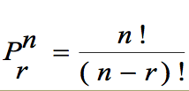
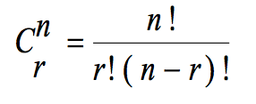
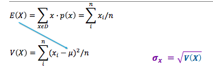

**Probabilidad de frecuencia**

**P(A) = n/N**

**
**

**n= número de elementos del evento A**

**N= número de elementos de la muestra o población**

```js
//para calcular frecuencia es necesario pasar la función
frequency(a,n)
//Dondé a es el array de posibles elementos
// y n el elemento del que se quiere conocer la frequencia
```

**Factorial: **Producto de todos los numeros positivos desde 1…n

Donde x es el numero que se quiere factorizar

```js
//Para llamar esta funcion es necesario
getFactorial(x);
//dondé x es el numero a factorizar
```

**Probability:** given a list of elements, what’s the probability of a certain event happening

Takes a list of elements and n = the number you want to find the probability

```js
getProbability(arr, n)
```


**Permutaciones: **Número de formas para seleccionar r de n elementos cuando el orden es importante



```js
//para llamar esta funcioón es necesario llamar
getPermutations(n,r);
//dondé n es el universo y r son los elementos a seleccionar
```

**Combinaciones: **Número de formas para seleccionar r de n elementos cuando el orden no es importante



```js
//para llamar esta funcioón es necesario llamar
getCombinations(n,r);
//dondé n es el universo y r son los elementos a seleccionar
```


**Funciones de densidad de probabilidad**
-----------------------------------------

**Media varianza y disviación estándar**

Varianza, media, desviación estandar:

Todos reciben una lista de elementos

```js
//Media
getMean(list)
//Varianza
getVariance(list)
//Desviación estandar
getStandardDeviation(list)
```



### Poisson distribution

To call a poisson distribution you will need:

```js
poisssonDistribution(a, t, limI, limS)
```

```js
poisssonDistributionLambda(lambda, limI, limS)
```

### Exponential distribution

```js
exponentialdistribution([list], limSuperior, limInferior)
```

```js
function exponentialDistribuiton(list, limS, limI) {
  let lamb = 1 / getMean(list);
  let low= (-1*lamb*limI);
  let high= (-1*lamb*limS);
  if (limS< 1) {
    dist =  Math.pow(Math.E, high)
  }
  else {
    dist = (1 - Math.pow(Math.E, high)) - (1 - Math.pow(Math.E, low))
  }
  console.log("lambda:" + lamb);
  return dist;
}
```


